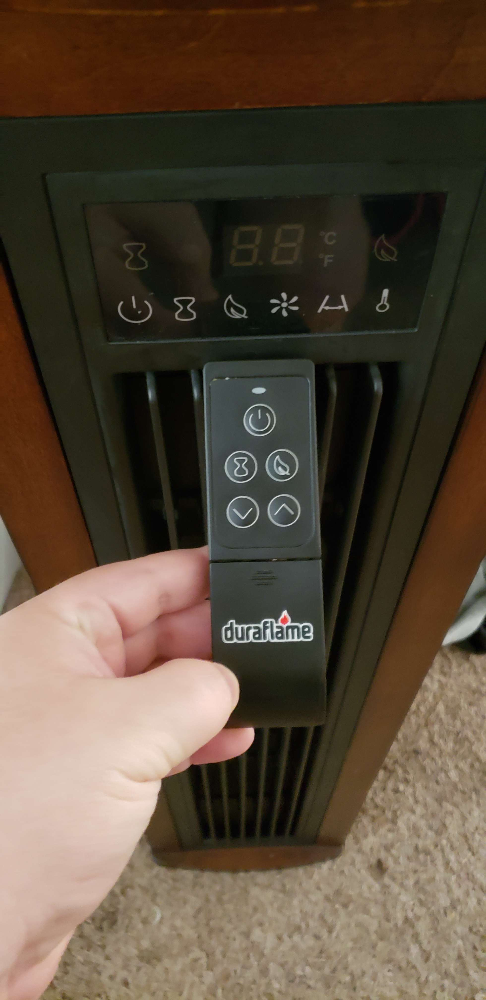

# Turnin' up the heat
// small intro //What you're trying to achieve

// explaination of conditions (what matches, why you think so, learn able, etc)

// image

// What you think

// What actually happens

// convenient? 

/// smores

<video controls="" width="500" height="800" muted="" loop="" autoplay="">
<source src="../assets/heatcontroller.mp4" type="video/mp4">
</video>
<video controls="" width="500" height="800" muted="" loop="" autoplay="">
<source src="../assets/heatdevice.mp4" type="video/mp4">
</video>
