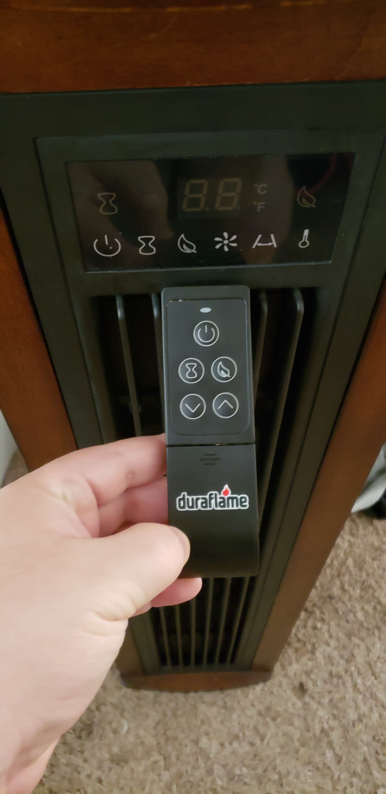

# Turnin' up the heat

I have a tower heater in my room that I use over winter. It's a Duraflame brand but theres very little information about the model itself. I got this heater second hand to get through colder nights without turning on the entire household AC. I didn't use it very often this winter despite being rather cold, and after taking a closer UX enlightened look, I can understand why. 

I know this isn't supposed to be a review, so I'll try to keep it in the context of actually accomplishing things, but there's quite a lot this device gets wrong when it comes to usability.

The heater itself comes with a controller. Already you might be noticing theres some differences here. There are 5 usable buttons on the controller (although easily room for 6) and 6 buttons on the device itself. The buttons do not match. 

This is probably fine though. I see some arrows, this is a temperature related device. Maybe those arrows change the temperature. Maybe the arrows change the time. 
At this point I've developed an idea in my head for what I believe this buttons will be used for. In the UX domain this is known as a **mental model**.
The reason for the assumption is because I've used devices like this before, typically an up or down arrow indicates I can change a setting up or down. This is a great example of **consistency and standards**, a [usability guideline that relies on previously established standards to onboard users](https://www.nngroup.com/articles/ten-usability-heuristics/#4-consistency-and-standards). Great!

Or rather it would be. 

<video controls="" width="500" height="800">
<source src="../assets/heatcontroller.mp4" type="video/mp4">
</video>

Hm. That's not quite right at all. I assumed something was going to happen and something completely different occurred. My **mental model** did not match the **conceptual model**. Suffice to say this almost feels like a cruel joke. The bottom arrow lowers the fan speed. The top arrow turns on eco mode. The Eco mode button, does change something as the sound changes, but gives the user no indication of what exactly happened, A specific violation of **visibility of system status** (another [usability heuristic](https://www.nngroup.com/articles/ten-usability-heuristics/#1-visibility-of-system-status)). If something changes in the system its best to let the user know about it in a clear and concise manner. More perplexing, however, is that they made the buttons different icons than the icons on the device, if the controller had the same icons I would be less likely to have come up with the assumptions that I did and this would have been a far more frictionless experience. 

The icons themselves demonstrate another area of usability heuristics, [recognition rather than recall](https://www.nngroup.com/articles/ten-usability-heuristics/#6-recognition-rather-than-recall)
Just looking at the icons on the device, I can sort of understand what each button does: power, timer, eco, fan, rotation and temperature. I see no arrows, so I can assume that I'll need to repeatedly press the icons to make changes. This again is an example of **consistency and standards**, I've used devices similar before. 

<video controls="" width="500" height="800">
<source src="../assets/heatdevice.mp4" type="video/mp4">
</video>

Sure enough, my **mental model and conceptual model are inline** and the experience isn't as jarring. Does it feel nice to have to repeatedly press the same button to get the desired temperature and if I skip my desired temperature must wrap back around? [Not one bit.](https://www.nngroup.com/articles/ten-usability-heuristics/#7-flexibility-and-efficiency-of-use) However, in this situation I knew what to expect. 

